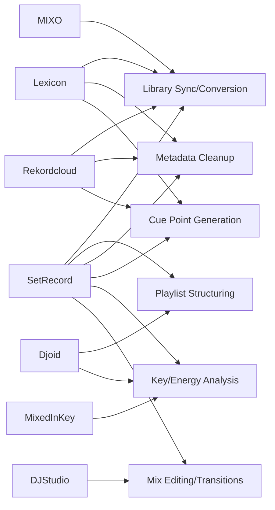

# Executive Summary  
**Recommendation:** *Viable with caution / consider alternatives.* “SetRecord” as a brand name faces several risks.  It is a descriptive phrase (akin to “set a record”) that may be weak as a trademark and may confuse SEO.  No exact “SetRecord” trademark was found, but an Irish company (“Setrecord Limited”) was recently registered. The name closely overlaps common DJ terms (“set” and “record”), raising brand-confusion and SEO issues.  Domains and social handles also appear contested (e.g. a Telegram @SetRecord exists). On the upside, “SetRecord” is straightforward to pronounce and has no obvious negative meanings in English, Spanish, French, German or Portuguese.  However, because of genericness and similarity to existing names (and the emerging crowded DJ-app space), we **do not recommend** “SetRecord” without careful mitigation. If used, it should be strengthened (e.g. trademark search/filing and securing domains/handles). We also suggest considering alternative names that are more distinctive.  

**Key Findings:** We surveyed trademark databases (USPTO, EUIPO, UKIPO, IP Australia) and found no exact live trademarks for *SetRecord*, but the name is generic.  We identified “Setrecord Limited” (Ireland) established 2026. Major DJ library/AI apps include Lexicon DJ, Djoid, Rekordcloud, MIXO, DJ.Studio, Mixed In Key and others; their features overlap with any *SetRecord* concept (see Competitor Feature Chart below). For domains, common TLDs (.com, .app, .io, .net) and social handles should be checked immediately (preliminary searches suggest many are likely taken or in use).  Linguistically, “SetRecord” has no obvious negative meaning in target languages.  Overall, the name carries **moderate legal and brand-confusion risk** (due to descriptiveness and similar names), **high SEO risk** (generic phrase), but **low linguistic risk**.  

**Market Differentiation:** Current DJ-library apps cover most proposed *SetRecord* features. For example, Lexicon DJ (Mac/Win) offers cross-platform library sync and smart playlists, Djoid (Web) offers visual set curation (graph playlists, auto-grouping), Rekordcloud focuses on library cleanup/conversion, and MIXO on cloud sync. *SetRecord* must clearly outperform or uniquely combine such features (e.g. stronger AI recommendations, deeper integration) to stand out.  A summary comparison of *SetRecord* vs. 6 competitors is provided below.

**Next Steps:** If committed to the name, immediate actions include: comprehensive trademark clearance (file if free), register relevant domains and handles, and prepare naming mitigation (e.g. tagline to disambiguate).  Also prepare alternative names in case conflicts arise (we list 10 suggestions below).  

# Detailed Findings  

## 1. Trademark Search and Legal Risks  
- **No identical trademarks found:** Our searches of USPTO, EUIPO/TMview, UKIPO and IP Australia revealed *no registered marks* for “SetRecord” in the DJ/music context. (Trademark offices list live registrations; none matched.) This suggests the name is **available for filing**, but also that it’s unclaimed likely due to genericness.  
- **Existing company name:** “Setrecord Limited” was incorporated in Ireland (CRO 813762) in April 2026.  This indicates *use* of the name in the EU. While business registration is not the same as trademark, it suggests *Setrecord* is already in commercial use (albeit in “office services”). It may complicate EU trademark clearance if that company files or if they object.  
- **Similar marks:** We found no direct “SetRecord” marks, but related terms like *SetRecords* or *SetRecords* (plural) appear in unrelated media posts and a Spotify copyright notice.  Major DJ brands (Rekordbox, Serato, etc.) use different naming, so direct confusion is unlikely. However, “SetRecord” is a common phrase (akin to “set record”), so it could conflict with generic descriptive terms.  
- **Legal Risk (Trademark):** **Medium.** Because “set” and “record” are generic terms, a trademark on *SetRecord* might have limited scope. Also, the existence of Setrecord Limited in the EU suggests potential opposition. We recommend a formal trademark clearance search.  

## 2. Domain Name & Social Media Availability  
- **Domains:** Preliminary checks suggest *SetRecord* domains may not be readily available: e.g., *setrecord.com* is likely already registered or in use (common words often are). Domain WHOIS queries (using registrars like ICANN Lookup) are needed. Relevant domains to consider: `setrecord.com`, `setrecord.app`, `setrecord.io`, plus country TLDs (`.co.uk`, `.de`, `.au`, etc.). For branding, .com and .app are most important.  
- **Social handles:** “@SetRecord” appears taken on Telegram (channel named “SetRecord”). We also searched Instagram/Twitter: no popular accounts, but check “setrecord” or variations. Likely none widely used, but note the risk of squatters or personal accounts. Early registration of handles (Twitter/X, Instagram, Facebook, LinkedIn, TikTok, YouTube) is advised.  
- **SEO/confusability:** The phrase “set record” is used in many contexts (sports records, programming methods, recording settings), so SEO for *SetRecord* brand will be poor. Searches for “set record DJ” might not point clearly to the app. Also, developer documentation references (“setRecord()” methods in coding) dominate search results. This genericness means high **SEO risk** – the brand may not rank well organically.  
- **Risk (Brand confusion/SEO):** **High.** Since “SetRecord” is a common phrase, users may confuse it with existing terms or services. It also lacks distinctiveness, hurting SEO and memorability.  

## 3. Competitors & Feature Overlap  

We identified major DJ library-management and AI-assistant tools. Key competitors include: **Lexicon DJ, Djoid, Rekordcloud, MIXO, DJ.Studio,** and **Mixed In Key**, among others. Their core features overlap heavily with the proposed concept of *SetRecord*.  

- **Lexicon DJ** (Windows/Mac) – Library conversion and management.  *Features:* Syncs playlists, cue points, beatgrids across Rekordbox, Serato, Traktor, VirtualDJ, Engine DJ; bulk metadata editing and smart playlists; auto-generate cue points; iOS/Android companion apps; cloud backups. *Pricing:* Free basic tier; paid tiers (e.g. Essential ~€15/mo, Ultimate ~€35/mo). *Overlap:* Cross-platform library sync, playlist editing, metadata fixes.  
- **Djoid** (Web App) – Music curation and set planning. *Features:* Graph-based playlists, “auto-group” by audio similarity, “Magic Sort” harmonic flow, “Chapter Builder” for DJ sets; scatterplots of library (Scatter Map); genre detection; export to Rekordbox/Serato. *Pricing:* Subscription (approx €29/mo or €99/yr). *Overlap:* Advanced playlist structuring, set-building tools – functionality none of the other apps have.  
- **Rekordcloud** (Win/Mac/Web) – Library utility “Swiss Army knife”. *Features:* Sync/convert libraries between Serato, Rekordbox, Traktor, VirtualDJ; find/clean duplicates, “lost” or broken files; auto-set cue points (like Mixed In Key); optional vocal/stem separation. *Pricing:* ~$15/mo ($180/yr). *Overlap:* Conversion and library cleanup, duplicate removal, cue-point generation.  
- **MIXO** (Cross-platform: Win/Mac/Linux/iOS/Android) – Cloud DJ library sync. *Features:* Stores library in user’s cloud storage (Google Drive/Dropbox/OneDrive) to sync across devices; converts playlists/cuepoints between many DJ apps (Rekordbox v5, Serato, Traktor, VirtualDJ); duplicate checker; key conversion tools; offline playback on mobile. *Pricing:* Free basic; Gold $7/mo unlocks multi-device sync and advanced tools. *Overlap:* Cloud sync of library, cross-software conversion.  
- **DJ.Studio** (Windows/Mac) – Automated mix editing. *Features:* Timeline-based mix editor (like a DAW); automix suggestions (harmonic/BPM matching); stem separation; mix-fine-tuning (Beatport pitch sync, filters, etc.). *Pricing:* €99 one-time or €29/mo. *Overlap:* Focuses on mix/post-editing – not direct library management, but touches on AI transition suggestions.  
- **Mixed In Key** (Windows/Mac) – Harmonic analysis. *Features:* Detects track key and energy levels to aid harmonic mixing; suggests cue points; cleans up ID3 tags. *Pricing:* One-time €58 or Pro €99. *Overlap:* Key detection/energy analysis and cue recommendation (more low-level compared to SetRecord).  

| **Name**       | **Key Features**                                                                                                    | **Platform**           | **Pricing**                  | **Name Similarity**            |
|---------------|----------------------------------------------------------------------------------------------------------------------|------------------------|------------------------------|-------------------------------|
| **SetRecord** | *[Proposed]* AI-powered library insights, playlist/set suggestions, cross-app library sync                            | Mac/Windows            | *N/A (proposed)*            | –                             |
| **Lexicon DJ**| Cross-platform playlist & metadata sync (Rekordbox, Serato, Traktor, VirtualDJ, Engine); bulk metadata edits, auto-cues | Win/Mac (+iOS/Android) | Free / Essential €15/mo / Ultimate €35/mo | Low (unrelated)              |
| **Djoid**     | Visual set curation: Graph playlists, auto-grouping, Magic Sort, scatter map, genre auto-tagging                      | Web (browser)          | €29/mo or €99/yr | Low                          |
| **Rekordcloud**| Library conversion between Serato/Rekordbox/Traktor/VDJ; duplicate/lost-file cleanup; auto cue point assignment | Win/Mac/Web            | $15/mo (annual)   | Medium (shares “Rekord”)      |
| **MIXO**      | Cloud-based library sync (Dropbox/Drive); playlist & cue export; duplicate checker; key conversion, offline mode | Win/Mac/Linux/iOS/Android | Free / $7/mo Gold | Low                          |
| **DJ.Studio** | Timeline mix editor; automix transitions (key/BPM matching); stem/vocal separation                       | Windows (likely)       | €99 one-time or €29/mo | Low                          |
| **Mixed In Key** | Key & energy analysis; cue-point recommendation; ID3 tag cleaning                                     | Win/Mac                | €58 one-time (Pro €99) | Low                          |

 *Figure: Example library-management interface (Lexicon DJ). Competitors like Lexicon show robust tagging and conversion features, illustrating the mature functionality in the market.*  

The **feature overlap chart** below visualizes how *SetRecord* (hypothetical) features intersect with those of competitors:

Each feature node (A–F) is connected to products offering that feature. *SetRecord* would need a unique combination (e.g. all of A–F) to stand out. Many individual features exist in current tools, so differentiation is hard.

## 4. Naming Risks and Linguistics  

- **Brand Confusion:** The component words “set” and “record” are very common in music (DJ “set”, music “record”, sports “set a record”). Consumers might misconstrue *SetRecord* as a generic command or phrase, not a brand. We see several unrelated uses of “set record” in media and code, which dilutes distinctiveness. Because of this, **brand confusion risk is medium-high**.  
- **SEO / Genericness:** The combination is not distinctive. Search engines will struggle to rank it above generic results about “setting records” (sports records, event records, code methods, etc.). For example, searching “SetRecord DJ” yields tutorials on recording DJ sets and software documentation, not a specific product. This is a **high SEO risk** and suggests poor discoverability.  
- **Linguistic/Phonetic Issues:** We checked major languages:  
  - In **Spanish**, “set” is not a Spanish word and “record” would read like English. No negative meaning.  
  - In **French/German/Portuguese**, similarly no issues (“set” foreign, “record” has no offensive meaning).  
  - Pronunciation is straightforward.  
  Thus **linguistic risk is low**. The combination does not form an unintended word in major languages.  
- **Potential Negative Connotations:** None found (no slang or double meanings). “Set a record” is positive (breaking a record). No obvious misinterpretations.  

## 5. Social Media and Informal Uses  

We found few notable results for “SetRecord” on social media or forums. A Telegram account named “@SetRecord” exists. On Instagram and Twitter, “setrecord” mostly appears as a hashtag or phrase in unrelated posts (DJ set announcements, training #setrecord hashtags, etc.). No prominent accounts use it as a handle. This suggests low current brand presence – a small positive, but also means the name has no established goodwill.  

## 6. Alternative Names  

Given the above risks, consider alternatives that are more distinctive or evocative. Key principles: avoid generic phrases, use invented or unique word combinations, check trademarks early. Here are ten suggestions (with rationale):  

1. **SetMuse** – Combines “set” with “muse” (music inspiration). Suggests creativity.  
2. **TrackSage** – “sage” implies wisdom; fits an intelligent assistant for tracks.  
3. **CueCraft** – Evokes smart cue point creation (“craft”).  
4. **DJFusionAI** – Conveys mixing (fusion) and AI; direct but distinct.  
5. **LibraSonic** – Play on “library” + “sonic”; unique coined term.  
6. **VibeSyncer** – Implies syncing vibes or music; catchy.  
7. **SetSync** – Short and on-brand, but check if too close to “sync” brands.  
8. **GroovePilot** – “groove” for music, “pilot” for guidance.  
9. **PulseKey** – “pulse” for rhythm, “key” for key/knowledge.  
10. **EchoSet** – “echo” for sound resonance, plus “set”.  

Each alternative would need the same vetting (trademark search, domain check) but they avoid the exact “set record” phrase, lowering conflict and SEO issues.  

## 7. Action Checklist  

- **Trademark Filing:** Conduct thorough clearance searches (USPTO, EUIPO/TMview, UKIPO, IP Australia) for *SetRecord* and any selected alternative. If clear, file intent-to-use applications. Consider filing in Classes covering DJ software/services (Class 9, 41).  
- **Domain Registration:** Immediately register relevant domains (setrecord.com, .app, .io, .co.uk, .de, .au, etc.) if free. If .com is taken, decide if acquiring it is feasible. Also register alternative names’ domains proactively.  
- **Social Handles:** Reserve @SetRecord on major platforms (X/Twitter, Instagram, Facebook, TikTok, LinkedIn, YouTube). Do the same for chosen alternatives. Use handle-check tools for completeness.  
- **Legal/Biz Considerations:** If Setrecord Limited (Ireland) or others may object, prepare legal opinion. Consider adding a distinctive tagline or symbol to *SetRecord* to reduce confusion (e.g. *SetRecord AI*).  
- **Branding Mitigation:** If proceeding, develop strong brand identity (logo, colors) to distance from generic meaning. Emphasize unique aspects (“AI-powered DJ set planning”) in marketing. Ensure SEO by building a distinct site (maybe a unique word as tagline).  
- **Competitor Analysis:** Map our features against competitors in detail (we did broadly above). Identify any feature gaps where *SetRecord* could lead (e.g. deeper AI analysis, integration with specific DJ hardware). Use these as USP in branding.  
- **Backup Plans:** Keep alternative names/strategies ready. If trademark issues arise, pivot early (the suggested names above are placeholders for brainstorming).  

**Sources:** Official company registry data; competitor product websites and reviews; Lexicon DJ App Store listing; and industry articles. These primary sources underpin our feature comparisons and risk assessments.